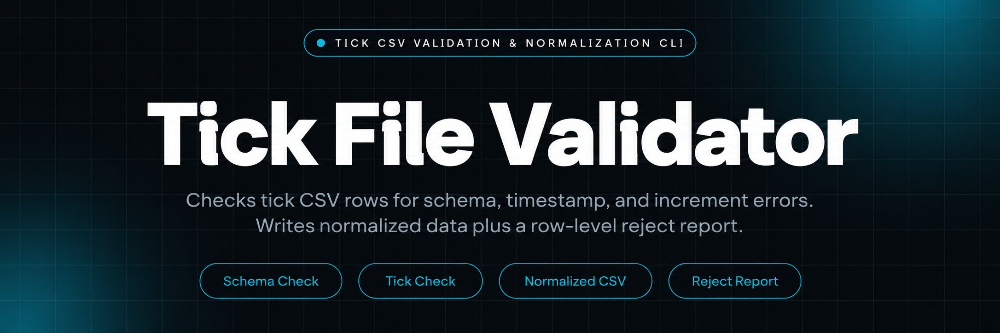
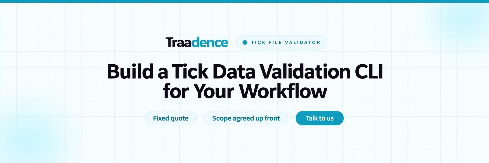
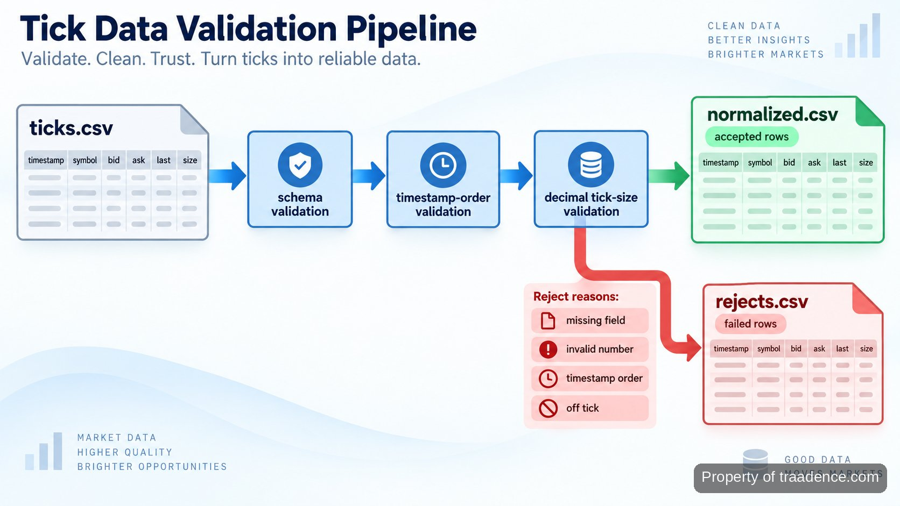

<p align="center">
  <a href="https://www.traadence.com" target="_blank" rel="nofollow">
    
  </a>
</p>

## tick kw 3

**tick kw 3** is the local command-line check I run before using exported tick data in trading research. It takes a CSV of timestamped market observations, verifies the required fields, checks chronological order, tests quoted values against a configured minimum tick increment, and separates usable rows from rejects. The point is narrow: catch structural data problems before they leak into a notebook, replay, chart, or downstream calculation.

The repository is intentionally an inspection utility rather than a trading engine. It does not connect to a broker, submit orders, generate signals, or decide whether a market is tradable. That boundary matters because a clean file and a trading decision are different problems. <a href="https://www.nasdaq.com/products/data/equities/nasdaq-basic" target="_blank" rel="nofollow">Nasdaq's Basic market-data specification</a> describes last-sale data as tick-by-tick price and size information, while <a href="https://www.cmegroup.com/education/files/describing-the-dynamic-nature-of-transactions-costs-during-political-even-risk-episodes.pdf" target="_blank" rel="nofollow">CME research on transaction costs</a> treats a tick as the permitted incremental movement for an instrument. The tool makes the instrument increment explicit at run time instead of burying it in code.

<a href="https://www.traadence.com" target="_blank" rel="nofollow">
  
</a>

<p align="center">
  <a href="https://t.me/Bitbash333" target="_blank" rel="nofollow">
    
  </a>&nbsp;
  <a href="https://wa.me/923249868488?text=Hi%2C%20I%27m%20interested." target="_blank" rel="nofollow">
    
  </a>&nbsp;
  <a href="mailto:hello@traadence.com" target="_blank" rel="nofollow">
    
  </a>&nbsp;
  <a href="https://www.traadence.com" target="_blank" rel="nofollow">
    
  </a>
</p>

## Input contract and output files

Input is one CSV with six fields: `timestamp`, `symbol`, `bid`, `ask`, `last`, and `size`. Timestamps must parse consistently, numeric fields must be finite, and each row must carry a symbol. The parser accepts ordinary comma-separated exports and keeps the original row number so a rejection can be traced back to the source file. CSV handling uses <a href="https://docs.python.org/3/" target="_blank" rel="nofollow">Python</a> and its [standard `csv` module](https://docs.python.org/3/library/csv.html), which keeps the runtime dependency surface small and makes delimiter and quoting behavior visible. The format is deliberately narrow because mixed schemas are harder to audit: if a source uses different headers, map them before this gate rather than letting the validator guess what a column means.

A successful run writes `normalized.csv` and `rejects.csv` into the selected output directory. The normalized file is sorted by timestamp and uses a stable column order. The reject file keeps the raw row plus a reason such as `missing_symbol`, `invalid_number`, `timestamp_order`, or `off_tick`. Standard output prints read, accepted, and rejected row counts. Nothing is silently repaired: a value that fails a rule stays out of the normalized dataset until the source data or configuration is corrected.

## Core Features

| Feature | Description |
| --- | --- |
| Schema validation | Missing or malformed fields make later analysis ambiguous. The validator checks the six-column contract before normalization and reports the source row that failed. |
| Timestamp ordering | Out-of-order observations can distort replay and interval calculations. Rows are parsed, compared in sequence, and flagged when time moves backward. |
| Tick-increment check | Off-grid quotes can come from bad conversions or the wrong instrument settings. A required `--tick-size` value is applied with decimal arithmetic rather than binary floating-point comparison. |
| Deterministic normalization | Ad hoc cleaning makes two researchers produce different files from the same export. Accepted rows are written in one column order and chronological sequence. |
| Reject report | Dropping bad rows hides the failure mode. Every rejected row is written separately with a machine-readable reason so the source can be audited. |

## What happens during a run

The pipeline is deliberately linear. First, the CLI resolves the input path and tick increment. Second, the reader maps each CSV row into typed fields. Third, schema and finite-number checks reject malformed records. Fourth, timestamps are compared in source order. Fifth, `bid`, `ask`, and `last` are tested against the configured increment. Accepted records are then sorted by timestamp and written to `normalized.csv`; failures go to `rejects.csv` with their original row numbers and reasons.

The increment check uses decimal arithmetic because market increments are stated as decimal values. The [Python `decimal` module](https://docs.python.org/3/library/decimal.html) is a better fit for exact base-10 comparisons than a binary float equality test. <a href="https://www.cmegroup.com/education/courses/introduction-to-futures/tick-movements-understanding-how-they-work" target="_blank" rel="nofollow">CME's tick-movement reference</a> gives a documented `0.25` increment for E-mini S&P 500 futures and a `0.01` increment for WTI crude oil. The same validator handles either case because the configuration, not the code, supplies the increment.



<a href="https://tally.so/r/vG5J40?platform=GitHub&amp;format=Product+repo&amp;brand=Traadence&amp;niche=trading&amp;page=Tick+Kw+3+Using+Python&amp;date=2026-09-11" target="_blank" rel="nofollow">
  
</a>

## Runtime stack and project layout

The runtime is Python with standard-library parsing and exact decimal comparison. [`argparse`](https://docs.python.org/3/library/argparse.html) defines the CLI so required paths and `--tick-size` errors fail before file processing begins. Tests use <a href="https://docs.pytest.org/en/stable/" target="_blank" rel="nofollow">pytest</a> for focused cases around malformed rows, ordering, and increment boundaries. The repository also includes a CI workflow that runs the test suite on pushes and pull requests, so changes to validation logic are checked before they are merged.

```text
tick-kw-3/
├── pyproject.toml
├── src/
│   └── tickkw3/
│       ├── __init__.py
│       ├── cli.py
│       ├── schema.py
│       ├── validate.py
│       ├── normalize.py
│       └── report.py
├── config/
│   └── instruments.example.csv
├── examples/
│   └── ticks.csv
├── tests/
│   ├── test_validate.py
│   └── test_normalize.py
├── .github/
│   └── workflows/
│       └── test.yml
└── output/
    └── .gitkeep
```

## Where it fits in trading research

The tool is most useful at the boundary between a market-data export and analysis code. It gives practitioners a repeatable gate before a file is treated as trustworthy, without pretending to judge the trading idea built on top of that file. That makes it suitable for research notebooks, event replays, visual inspection, or any workflow where bad ordering and off-grid values would create misleading downstream behavior. In practice, that gate is most valuable when files come from more than one session or source and a small schema drift would otherwise be discovered only after analysis has started. Keeping the rejected rows beside the accepted file also makes a rerun explainable: a changed output can be tied to changed source data, a different increment, or a different code revision rather than to an invisible cleaning step.

- Prepare vendor or venue exports for research by separating malformed rows before a notebook loads the dataset.
- Check replay inputs so a backward timestamp is visible as a data-quality failure rather than surfacing later as a strange sequence.
- Verify instrument increments when moving between contracts or symbols by changing `--tick-size` at the command line instead of editing validation code.
- Keep rejected observations for audit work instead of deleting them, making it possible to compare source rows with the normalized file.

## How to Validate Tick Files Using tick kw 3

- **STEP 1 — Download & Set Up the Project**  
Download, set up, and install **tick kw 3** from this repository, create a virtual environment, and install the project so the module command is available locally.
- **STEP 2 — Open the CLI**  
Open a terminal at the repository root and confirm the command surface with `python -m tickkw3 --help` before processing a market-data export.
- **STEP 3 — Set the Input Rules**  
Pass the CSV path, the instrument's decimal increment through `--tick-size`, and an output directory. Keep the increment aligned with the instrument specification.
- **STEP 4 — Run and Inspect Output**  
Run `validate`; then inspect `normalized.csv`, `rejects.csv`, and the terminal counts before the normalized file is handed to research code.

```bash
python -m venv .venv
source .venv/bin/activate
python -m pip install -e ".[dev]"
python -m tickkw3 validate examples/ticks.csv --tick-size 0.25 --out output/
```

## Validation behavior in practice

The useful part of the tool is not that it can read CSV; it is that failure has a visible shape. If a row is missing `symbol`, the record goes to the reject file with `missing_symbol`. If a timestamp parses but moves backward relative to the preceding source row, the reason is `timestamp_order`. If a numeric field cannot be parsed or is non-finite, it receives `invalid_number`. An otherwise valid quote that does not land on the supplied increment receives `off_tick`.

This approach avoids two common research mistakes: coercing malformed values into something that looks numeric, and deleting rows without preserving why they disappeared. The source row number stays attached to each rejection, so inspection starts from evidence rather than guesswork. The normalized output is therefore a filtered dataset, not a claim that the source feed was correct. That distinction is useful when comparing exports from different sessions or checking whether an instrument configuration changed.

## Performance, repeatability, and limits

The repository does not publish a fixed throughput figure because no measured benchmark dataset is part of this page. Runtime depends on row count, storage speed, and the machine running the command. What is stable is the method: the same input file, same tick increment, and same code revision produce the same accepted rows, reject reasons, and sorted output. That makes regression testing more useful than an unqualified speed claim.

For local benchmarking, run the command against a representative file and record wall-clock time together with the input row count and commit hash. Keep that measurement beside the dataset if processing time matters to the research workflow. The current scope is batch CSV validation; it is not a live feed handler, broker adapter, order-book reconstructor, or execution service. It also does not infer an instrument's increment automatically. The operator must supply the correct value from the venue or instrument specification, which keeps a market rule from being guessed inside the program. Record both accepted and rejected counts with the timing result; a faster run that processed fewer valid rows is not a meaningful comparison.

## FAQ

### What columns does the input file require?

The CSV requires `timestamp`, `symbol`, `bid`, `ask`, `last`, and `size`. Rows with missing required fields or values that cannot be parsed are written to `rejects.csv` with the original row number and a reason.

### How are off-grid tick values handled?

They are rejected, not rounded. The CLI compares `bid`, `ask`, and `last` with the supplied decimal increment and writes any off-grid row to the reject file as `off_tick`, preserving the source row for review.

### Does the tool place trades or connect to a broker?

No. It is a local batch validator for exported tick data. Broker connectivity, signal generation, order submission, and live-feed processing are outside the repository's scope.

<table>
  <tr>
    <td align="center" width="33%">
      
      <p>This scraper helped me gather thousands of posts effortlessly. The setup was fast, and exports are super clean and well-structured.</p>
      <p><b>Nathan Pennington</b><br>Marketer<br>★★★★★</p>
    </td>
    <td align="center" width="33%">
      
      <p>What impressed me most was how accurate the extracted data is. Likes, comments, timestamps — everything aligns perfectly.</p>
      <p><b>Greg Jeffries</b><br>SEO Affiliate Expert<br>★★★★★</p>
    </td>
    <td align="center" width="33%">
      
      <p>It's by far the best tool I've used. Ideal for trend tracking, competitor monitoring, and influencer insights.</p>
      <p><b>Karan</b><br>Digital Strategist<br>★★★★★</p>
    </td>
  </tr>
</table>